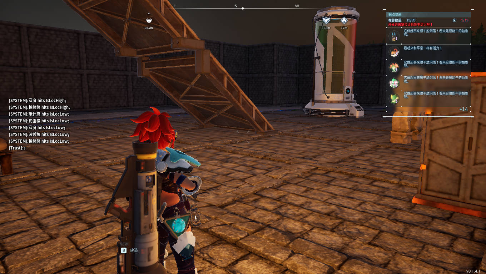

# AbnormalWorkerManager_BP (AWM_BP)

A Palworld mod to monitor some abnormal cases for base camp pal workers.

Standalone version at [https://github.com/Trust04zh/AbnormalWorkerMonitor](https://github.com/Trust04zh/AbnormalWorkerMonitor), which is not compatible with ue4ss, but more configurable and powerful.

Current features:

- teleport pal worker with abnormal spawn point to its base camp on mod load.
- teleport pal worker of abnormal cases to its base camp.
  - sanity low (< 50)
  - hungry
  - outside base camp
  - too low (default 500)
  - too high (default 1000)

Press key `0` to send debugging chat message to show you location.

#### Usage

Enter a world, the mod sends chat message if it teleports your pal worker. There would also be debug message in ue4ss console if you enabled.

#### Install

Install like other ue4ss .pak mods.

~~TODO: write one~~

Note that all .pak files are same, **put one and only one (must rename to `AbnormalWorkerMonitor_BP.pak`) to the mod foler**. The chunk id for the default one is `117`.

#### Gossips

You would see many messages when entering a world, don't worry.

#### Acknowledgement

[PalworldModdingKit](https://github.com/localcc/PalworldModdingKit)

[RE-UE4SS](https://github.com/UE4SS-RE/RE-UE4SS)
